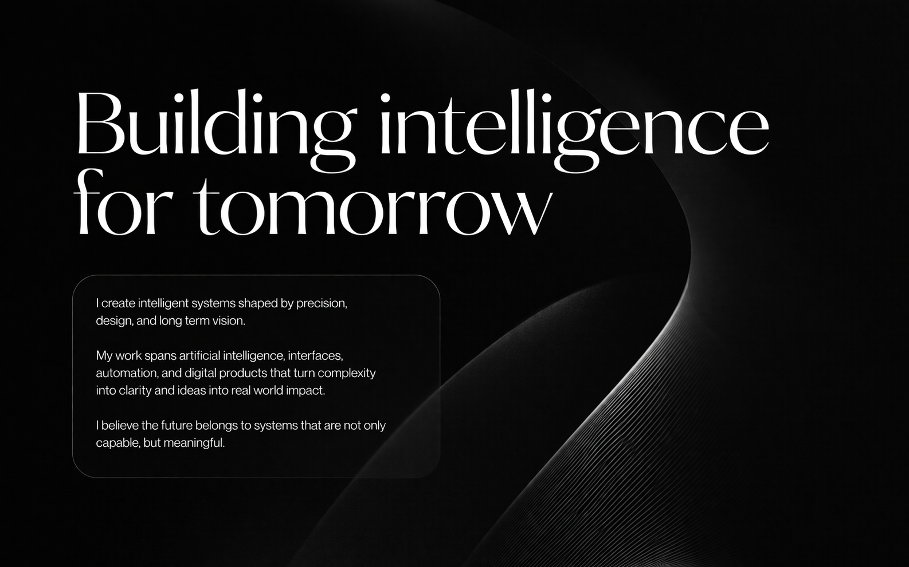

<div align="center">


</div>

<br/>

<div align="center">

```
d i e g o s a n t d e v
```

[](https://git.io/typing-svg)

<br/>

I build and ship AI systems, developer tools, and scalable products focused on real-world usage.
From idea to production, end-to-end, efficient, fast, and impactful.

<br/>

[](https://github.com/diegosantdev)
[](https://github.com/diegosantdev)
[](https://github.com/diegosantdev?tab=repositories)
[-139-ffffff?style=flat-square&labelColor=0d1117)](https://github.com/diegosantdev)

</div>

---


<br/>

### `whoami`

```bash
$ cat about.json
```

```json
{
  "name":     "Diego",
  "handle":   "diegosantdev",
  "title":    "AI Systems Engineer",
  "vision":   "Systems that are not only capable, but meaningful.",
  "focus":    [
                "LLM-based systems and pipelines",
                "Multimodal AI: text, image, documents",
                "Developer tools and infrastructure",
                "Automation and data-driven platforms",
                "Full-stack, end-to-end architectures"
              ],
  "approach": "idea to production, fast",
  "priority": "things that actually get used",
  "status":   "shipping"
}
```

---

<br/>

### `> what_i_build`

| | |
|:--|:--|
| **AI SYSTEMS** | LLM integrations, multimodal pipelines, prompt engineering, RAG, AI agents |
| **DEV TOOLS** | CLIs, SDKs, OSS libs, npm packages, infrastructure and automation tooling |
| **PRODUCTS** | Full-stack apps, APIs, SaaS platforms, data systems from zero to production |
| **AUTOMATION** | Pipelines, event-driven systems, scheduled jobs, workflow orchestration |

---

<br/>

### `> tech_stack`

I work across the full stack, from AI layers to databases, infra, and UI.

**AI and LLMs**


**Languages**


**Backend and APIs**


**Frontend**


**Data and Infra**


---
<div align="center">


</div>

<br/>

### `> featured_repos`

<div align="center">

| Project | What it does | Stack | Stars |
|---|---|---|:---:|
| [**LicensePulse**](https://github.com/diegosantdev/LicensePulse) | OSS license watchdog. Monitors your dependencies and alerts when a license changes, explaining exactly what you can no longer do. | JS · GitHub API | ⭐ 29 |
| [**LeadStrike**](https://github.com/diegosantdev/LeadStrike) | Revenue intelligence engine. Finds high-intent local business leads automatically, before your competitors. | JS · Data | ⭐ 1 |
| [**Promptinel**](https://github.com/diegosantdev/Promptinel) | LLM prompt drift monitor. Detects behavior changes in AI systems before your users notice anything is wrong. | JS · LLM | ⭐ 1 |
| [**publishcanary**](https://github.com/diegosantdev/publishcanary) | npm security sentinel. Scans your publish tarball and blocks source leaks, secrets, and oversized artifacts before release. | JS · npm | ⭐ 1 |

</div>

---

<br/>

### `> stats`

<div align="center">


</div>

<div align="center">


</div>

---

<br/>

### `> activity`

<div align="center">

[](https://github.com/diegosantdev)

</div>

---

<br/>

### `> contributions`

<div align="center">


</div>

---

<br/>

<div align="center">



<br/><br/>

```
"I believe the future belongs to systems
 that are not only capable, but meaningful."
```

<br/>


</div>

---

<div align="center">
<sub>shipping AI systems · developer tools · scalable products · <code>diegosantdev</code> · 2026</sub>
</div>
